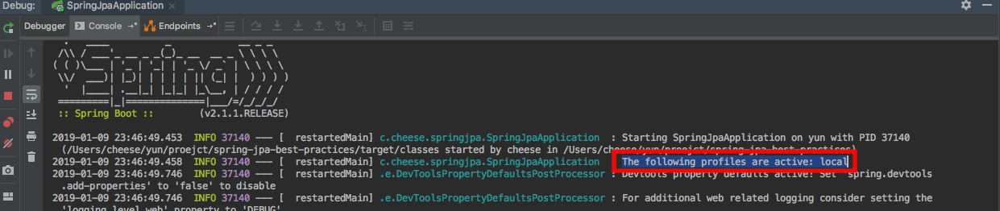

# step-11: Properties environment 설정하기

properties.yml 설정 파일을 이용해서 environment를 편리하게 설정하는 방법을 소개해드리겠습니다. 설정 정보는 애플리케이션 코드와 분리돼서 관리되고 각 환경에 따라 달라지(DB 정보, 외부 서비스 정보 등등)는 정보들은 각 properties 파일에서 관리되는 것이 좋습니다.


| environment | 설명      | 파일명                   |
| ----------- | ------- | --------------------- |
| local       | 로컬 개발환경 | application-local.yml |
| dev         | 개발환경    | application-dev.yml   |
| prod        | 운영      | application-prod.yml  |


위 처럼 환경이 분리되었을 경우를 기준으로 설명드리겠습니다.


## application.yml
```yml
server:
  port: 8080
```
* 모든 환경에서 공통으로 사용할 정보들을 작성합니다.
* 모든 환경에서 사용할 것을 공통으로 사용하기 때문에 코드의 중복과 변경에 이점이 있습니다.
* 본 예제에서는 port만 공통으로 설정했습니다.

## application-{env}.yml

```yml
user:
  email: "yun@test"
  nickname: "nickname"
  age: 28
  auth: false
  amount: 101

spring:
  jpa:
    database: h2
    hibernate:
      ddl-auto: create-drop
    show-sql: true
  datasource:
    data: classpath:init.sql # 시작할때 실행시킬 script

  jackson:
    serialization:
      WRITE_DATES_AS_TIMESTAMPS: false

logging:
  level:
    ROOT: info
```
* 각 개발환경에 맞는 properties 설정을 정의합니다.
* 대표적으로 데이터베이스 정보, 외부 설정 정보 등이 있습니다.
* `application.yml` 에서 정의한 `server.port` 8080 값을 자동으로 설정됩니다.

## env 설정 방법

### application.yml에서 설정하는 방법
```yml
spring:
  profiles:
    active: local

server:
  port: 8080
```
* `profiles.active` 속성에 원하는 정보 env를 작성합니다.

### IntelliJ에서 설정 하는 방법


IntelliJ에서는 외부에서 넙겨 받는 인자로 다양한 환경 설정을 제공해줍니다. 가장 대표적인 방법으로 VM options, Active profiles 설정이 있습니다. 아래의 방법중 하나를 선택하면 됩니다.

* VM options에 `-Dspring.profiles.active={env}` 추가합니다.
* Active profiles: `{env}` 


## 우선순위
외부 환경 설정에 대한 우선순위는 [Spring-Boot Document](https://docs.spring.io/spring-boot/docs/current/reference/html/boot-features-external-config.html#boot-features-external-config)에 표시되어 있습니다. 실제 배포시에는 우선순위를 반드시 고려해야합니다. 

## env 구동
```yml
spring:
  profiles:
    active: local

server:
  port: 8080
```
`application.yml`으로 설정해서 스프링을 구동시켜보겠습니다.



`application.yml`에서 설정한 local 환경설정이 동작하는 것을 확인할 수 있습니다.
