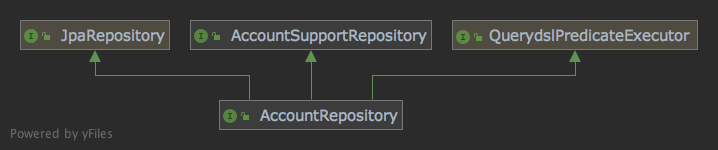
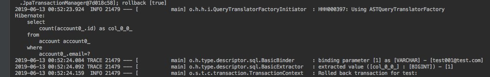

# step-16: Querydsl를 이용해서 Repository 확장하기 (2)

JpaRepository의 쿼리 메서드를 통해서 간단한 쿼리들을 아래 예제 처럼 쉽게 만들수 있습니다.

```java
public interface AccountRepository extends JpaRepository<Account, Long> {

  boolean existsByEmail(Email email);

  boolean exsistByxxx(...)

  long countByEmail(Email email);

  long countByxxx(...)
}
```
유사한 쿼리가 필요해지면 쿼리 메서드를 지속적으로 추가해야 하는 단점이 있습니다. 이런 경우에 `QuerydslPredicateExecutor`를 사용하면 매우 효과적입니다.


## QuerydslPredicateExecutor

```java
public interface QuerydslPredicateExecutor<T> {

  ....

  long count(Predicate predicate);            

  boolean exists(Predicate predicate);        

}
```

`QuerydslPredicateExecutor` 코드의 일부입니다. `Predicate`를 매개변수로 받고 있기 때문에 Predicate를 통해서 새로운 쿼리를 만들수 있습니다.

## AccountRepository 적용하기

```java
public interface AccountRepository extends JpaRepository<Account, Long>, AccountSupportRepository,
    QuerydslPredicateExecutor<Account> {

        ...
}
```
`AccountSupportRepository`는 [step-15: Querydsl를 이용해서 Repository 확장하기(1)](https://github.com/cheese10yun/spring-jpa-best-practices/blob/master/doc/step-15.md) 에서 추가한 코드이고 `QuerydslPredicateExecutor<Account>` 코드만 추가하면 완료 됩니다.

## QuerydslPredicateExecutor 사용하기



`AccountRepository`는 `QuerydslPredicateExecutor`를 구현하고 있음으로 별다른 코드 없이 우리는 `AccountRepository`를 통해서 `QuerydslPredicateExecutor`의 메서드를 사용할 수 있습니다. 이것은 우리가 `AccountRepository`가 아무 메서드가 없어도 `JpaRepository`에 있는 findById, findAll 같은 메서드를 사용할 수 있는 이유와 동일합니다. 

### Test Code

```java
@DataJpaTest
@RunWith(SpringRunner.class)
public class AccountRepositoryTest {

  @Autowired
  private AccountRepository accountRepository;

  private final QAccount qAccount = QAccount.account;

  @Test
  public void predicate_test_001() {
    //given
    final Predicate predicate = qAccount.email.eq(Email.of("test001@test.com"));

    //when
    final boolean exists = accountRepository.exists(predicate);

    //then
    assertThat(exists).isTrue();
  }

  @Test
  public void predicate_test_002() {
    //given
    final Predicate predicate = qAccount.firstName.eq("test");

    //when
    final boolean exists = accountRepository.exists(predicate);

    //then
    assertThat(exists).isFalse();
  }

  @Test
  public void predicate_test_003() {
    //given
    final Predicate predicate = qAccount.email.value.like("test%");

    //when
    final long count = accountRepository.count(predicate);

    //then
    assertThat(count).isGreaterThan(1);
  }

}
```
Predicate 객체 생성을 통해서 쿼리메서드 코드 추가 없이 다양한 쿼리들을 쉽게 만들 수 있습니다.



`predicate_test_001` 테스트 코드에 대한 실제 쿼리 내용입니다. 해당 쿼리가 어떻게 출력되는지 직접 눈으로 확인하는 습관을 갖는 것이 좋습니다.

## 결론
조회용 쿼리를 만드는 것은 실제 현업에서 많은 업무 비중을 차지하다 보니 작업자들은 다양한 조회 전용 구현체들을 우후죽순처럼 만들게 됩니다. 이렇게 되면 중복 코드가 많이 발생하게 되고, 구현체가 늘어나는 만큼 의존 관계도 자연스레 높아지게 됩니다.

이러한 문제를 위와 같이 객체지향 관점으로 풀어내어 `AccountRepository` 인터페이스를 통해서 DAO가 제공되고 세부 구현들을 숨길 수 있게 설계하는 것이 바람직하다고 생각합니다. 

**단순하게 JPA를 잘 활용하는 것보다 위에서 언급한 내용을 조금 더 깊게 생각해보는 것이 이 포스팅에 취지입니다.**

